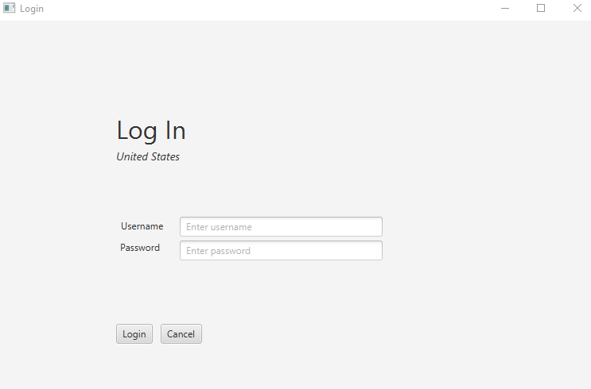
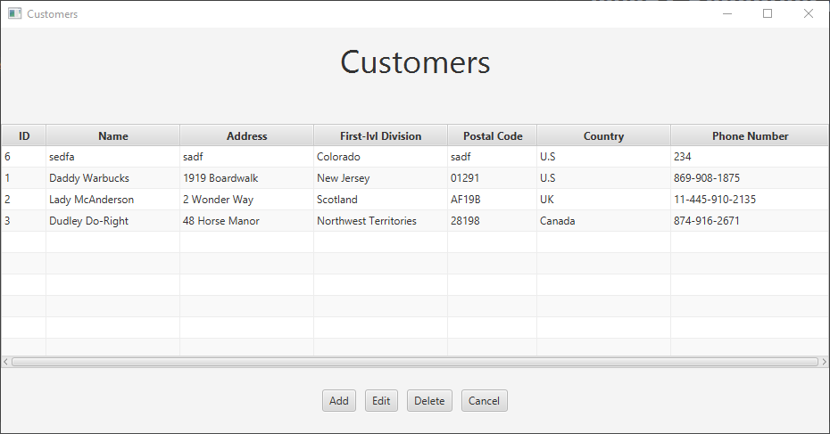

# JavaFX Scheduler App

## About

- Class project for my Software II Class

## Screenshots

    
Login Screen

    

    
Home Screen

    

    
Customers Screen

    

    
Add New Customer Screen

    

